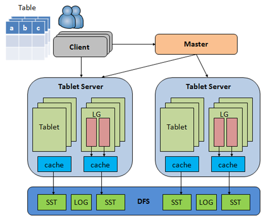

# Tera - An Internet-Scale Database

Copyright 2015, Baidu, Inc.

Tera is a high performance distributed NoSQL database, which is inspired by google's [BigTable](http://static.googleusercontent.com/media/research.google.com/zh-CN//archive/bigtable-osdi06.pdf) and designed for real-time applications. Tera can easily scale to __petabytes__ of data across __thousands__ of commodity servers. Besides, Tera is widely used in many Baidu products with varied demands，which range from throughput-oriented applications to latency-sensitive service, including web indexing, WebPage DB, LinkBase DB, etc. ([中文](readme-cn.md))

## Features

* Linear and modular scalability
* Automatic and configurable sharding
* Ranged and hashed sharding strategies
* MVCC
* Column-oriented storage and locality group support
* Strictly consistent
* Automatic failover support
* Online schema change
* Snapshot support
* Support RAMDISK/SSD/DFS tiered cache
* Block cache and Bloom Filters for real-time queries
* Multi-type table support (RAMDISK/SSD/DISK table)
* Easy to use [C++](doc/en/sdk_guide.md)/[Java](doc/en/sdk_guide_java.md)/[Python](doc/en/sdk_guide_python.md)/[REST-ful](doc/en/sdk_guide_http.md) API

## Data model

Tera is the collection of many sparse, distributed, multidimensional tables. The table is indexed by a row key, column key, and a timestamp; each value in the table is an uninterpreted array of bytes.

* (row:string, (column family+qualifier):string, time:int64) → string

To learn more about the schema, you can refer to [BigTable](http://static.googleusercontent.com/media/research.google.com/zh-CN//archive/bigtable-osdi06.pdf).

## Architecture

Tera has three major components: sdk, master and tablet servers.

- __SDK__: a library that is linked into every application client to access Tera cluster.
- __Master__: master is responsible for managing tablet servers and tablets, automatic load balance and garbage collection of files in filesystem.
- __Tablet Server__: tablet server is the core module in tera, and it uses an __enhance__ [Leveldb](https://github.com/google/leveldb) as a basic storage engine. Tablet server manages a set of tablets, handles read/write/scan requests and schedule tablet split and merge online.

## Building blocks
Tera is built on several pieces of open source infrastructure.

- __Filesystem__ (required)

	Tera uses the distributed file system to store transaction log and data files. So Tera uses an abstract file system interface, called Env, to adapt to different implementations of file systems (e.g., [BFS](https://github.com/baidu/bfs), HDFS, HDFS2, POXIS filesystem).

- __Distributed lock service__ (required)

	Tera relies on a highly-available and persistent distributed lock service, which is used for a variety of tasks: to ensure that there is at most one active master at any time; to store meta table's location, to discover new tablet server and finalize tablet server deaths. Tera has an adapter class to adapt to different implementations of lock service (e.g., ZooKeeper, [Nexus](https://github.com/baidu/ins))

- __High performance RPC framework__ (required)

	Tera is designed to handle a variety of demanding workloads, which range from throughput-oriented applications to latency-sensitive service. So Tera needs a high performance network programming framework. Now Tera heavily relies on [Sofa-pbrpc](https://github.com/baidu/sofa-pbrpc/) to meet the performance demand.
	
- __Cluster management system__ (not necessary)
		
	A Tera cluster in Baidu typically operates in a shared pool of machines
that runs a wide variety of other distributed applications. So Tera can be deployed in a cluster management system [Galaxy](https://github.com/baidu/galaxy), which uses for scheduling jobs, managing resources on shared machines, dealing with machine failures, and monitoring machine status. Besides, Tera can also be deployed on RAW machine or in Docker container.

## Documents

* [Developer Doc](doc/README.md)

## Quick start
* __How to build__

	Use sh [./build.sh](BUILD) to build Tera.

* __How to deploy__

	[Pseudo Distributed Mode](doc/onebox.md)

	[Build on Docker](example/docker)
	
* __How to access__
	
	[teracli](doc/teracli.md)
	
	[API](doc/en/sdk_guide.md)

## Contributing to Tera  
Contributions are welcomed and greatly appreciated. See [Contributions](doc/contributor.md) for more details.

## Follow us
To join us, please send resume to {dist-lab, tera_dev, opensearch} at baidu.com.

